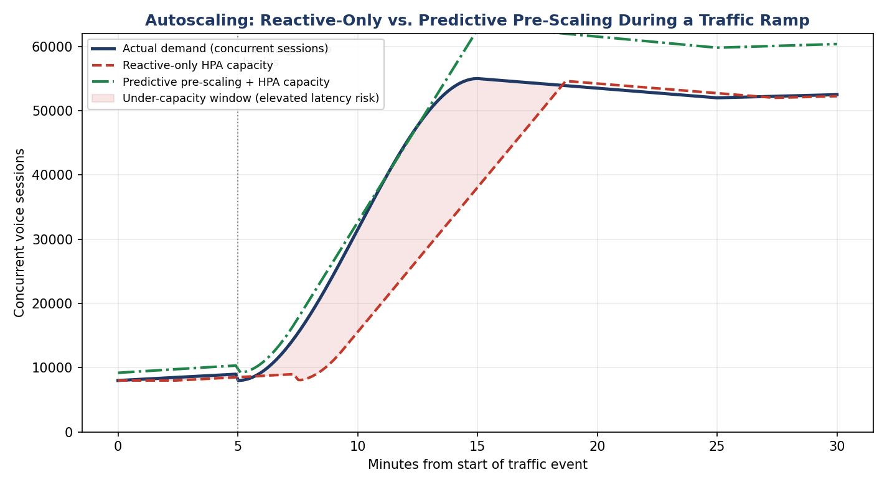

# MIRA — Production Runbook: Post-Deployment Issues & Autoscaling

The design document (Chapter 18) covers **fail-stop scenarios** — a
dependency goes down and the system needs to degrade gracefully. This
document covers the other half of production reality: **steady-state
issues that show up weeks or months after a clean launch**, the kind that
don't trip an outage alert but quietly erode quality, cost, or trust.
Each entry follows the same format: what you'd see, why it happens, what
to do right now, and what to fix so it doesn't recur.

---

## Part 1 — How Autoscaling Actually Works

### 1.1 Two independent scaling problems

MIRA scales at two levels that are easy to conflate but need separate
handling:

1. **Pod-level scaling (HPA)** — "do I have enough replicas of this
   service running right now." Reacts in seconds to tens of seconds.
2. **Node-level scaling (Cluster Autoscaler / Karpenter)** — "does the
   underlying EKS cluster have enough EC2 capacity to schedule those
   pods." Reacts in tens of seconds to a few minutes, because it involves
   actually provisioning a new EC2 instance, waiting for it to join the
   cluster, and passing kubelet readiness checks.

A pod can be "ready to scale up" per HPA math and still be stuck
`Pending` for 60-90 seconds waiting on node-level capacity. This gap is
the single most common cause of a scaling-related latency spike that
engineers don't expect the first time they see it.

### 1.2 What actually drives the scale-up decision

For the orchestration pods (`k8s/orchestration-deployment.yaml`), HPA
watches a **custom metric** — active sessions per pod, sourced from
Prometheus via the Prometheus Adapter (or KEDA, which is simpler to
operate if you don't already run the Prometheus Adapter) — not raw CPU.
CPU is a lagging indicator for an I/O-bound workload spending most of its
time waiting on LLM API responses; a pod can be CPU-idle and still be at
its concurrent-session capacity limit.

For the voice-gateway pods, the metric is active calls per pod, because
each call pins to a specific pod for the media session's duration
(design doc Ch. 15, Q2) — you can't rebalance an in-progress call the way
you can load-balance a new stateless HTTP request.

### 1.3 Why reactive-only autoscaling isn't sufficient by itself

The chart below models a realistic flash-sale-style traffic ramp
(8,000 → 55,000 concurrent sessions over ~10 minutes) and compares two
strategies:

- **Reactive-only** (red dashed line): HPA only starts reacting once
  demand has already risen enough to breach the scaling threshold, then
  is further rate-limited by how fast new pods/nodes can actually come
  online. The shaded region is the window where **capacity is behind
  demand** — this is where p99 latency spikes past the 1-second budget,
  calls queue, and (worst case) new session admission gets throttled or
  rejected.
- **Predictive pre-scaling** (green dash-dot line): capacity is
  pre-warmed *ahead* of a known traffic event (a scheduled campaign
  launch, a historical time-of-day pattern) so there's no catch-up lag at
  all — this is why the design doc (Ch. 15.2) treats predictive
  pre-scaling as a first-class strategy, not a nice-to-have on top of HPA.

### 1.4 The knobs that actually matter, concretely

| Knob | Where | What it controls | Production guidance |
|---|---|---|---|
| `averageValue` target (e.g., 40 sessions/pod) | HPA custom-metric spec | How aggressively new pods spin up | Set *below* real per-pod capacity (Ch. 15.2's "conservative threshold") — e.g., if a pod can actually handle 60 sessions, target 40, so there's headroom while new pods catch up |
| `stabilizationWindowSeconds` (scale-up) | HPA `behavior.scaleUp` | How fast HPA reacts to a spike vs. how much it avoids flapping on noise | Short (10-15s) for voice-gateway/orchestration — latency risk from under-scaling is worse than the cost risk of a slightly premature scale-up |
| `stabilizationWindowSeconds` (scale-down) | HPA `behavior.scaleDown` | How fast capacity is released after a spike passes | Long (300s+) — scaling down too fast right after a spike, into a second smaller wave of the same traffic event, causes a second latency spike |
| Node provisioning lead time | Cluster Autoscaler / Karpenter config, EC2 instance type | How long a genuinely new node takes to become schedulable | Use pre-warmed node pools or Karpenter's faster provisioning; keep a small buffer of "spare" capacity (`minReplicas` set above bare steady-state) for latency-critical namespaces |
| Predictive schedule | A scheduled scaling profile (e.g., a CronJob adjusting `minReplicas`, or a KEDA cron trigger) | Pre-warms capacity ahead of *known* events | Only covers *known* events (campaigns, festive dates) — doesn't help with a genuinely surprise viral spike, which is what reactive HPA + headroom is still needed for |

### 1.5 Voice-gateway scaling is different from orchestration scaling

Because each call is pinned to a pod for its duration, "scaling down" a
voice-gateway pod can't just kill it — it has to **drain** first (stop
accepting new sessions, let existing calls finish, then terminate). This
is why `k8s/hpa-voice-gateway.yaml` sets a 120-second
`terminationGracePeriodSeconds` and a `preStop` hook that calls a
`/drain` endpoint before the pod is removed. If you skip this and just
let Kubernetes SIGTERM the pod on scale-down, you'll drop live calls
mid-conversation — a real production incident, not a theoretical one.

---

## Part 2 — Post-Deployment Production Issues

Each entry: **Symptom → Root Cause → Immediate Mitigation → Long-Term Fix**.

### 2.1 Silent LLM quality regression after a provider-side model update

- **Symptom**: no deploy happened on your side, but escalation rate
  creeps up, or LangSmith production-quality scores (Ch. 16.4) drift
  downward over a few days.
- **Root cause**: the LLM provider updated the model behind the same
  API/version string, and its behavior on your specific prompts shifted
  slightly (more verbose, different tool-call habits, different tone).
- **Immediate mitigation**: pin to a dated model snapshot if the provider
  offers one; if not, temporarily increase the LLM-as-judge evaluator
  sampling rate on production traffic to characterize the drift precisely
  before deciding whether to act.
- **Long-term fix**: treat model version as a tracked, changelogged
  dependency — alert on LangSmith score drift with no corresponding
  deploy in your own git history (this pattern is the tell), and budget
  time each quarter to re-run the full eval suite against the latest
  model version proactively rather than reactively.

### 2.2 Guardrail false positives blocking legitimate conversations

- **Symptom**: users report MIRA "getting stuck" or repeatedly saying
  "let me double check that" on requests that are completely normal
  (e.g., `scan_output`'s numeric-claim regex firing on a phone number or
  a non-financial count the user asked about).
- **Root cause**: the deterministic guardrail patterns (`mira/guardrails.py`)
  are intentionally conservative and can over-match — a regulated-domain
  agent stating "there are 3 service centers near you" contains a number
  but isn't a financial claim.
- **Immediate mitigation**: check the `guardrail_flags` field in recent
  traces for the affected sessions; if it's a clear false positive
  pattern, add a narrow exclusion rule rather than loosening the check
  broadly.
- **Long-term fix**: guardrail precision/recall should be tracked as its
  own metric (false-positive rate on the eval suite's non-adversarial
  examples, not just true-positive rate on red-team examples) — a
  guardrail that blocks too aggressively is a real production quality
  issue, not just a "better safe than sorry" freebie.

### 2.3 Guardrail false negatives found via audit, not via an incident

- **Symptom**: a periodic manual/automated audit of production transcripts
  (sampling, per Ch. 13.4) turns up a case where a numeric claim slipped
  through without a backing tool call.
- **Root cause**: the regex-based numeric pattern (`_NUMERIC_CLAIM_RE`)
  doesn't catch every phrasing (e.g., spelled-out numbers, unusual
  currency formatting) — deterministic guardrails are precise but not
  exhaustive by construction.
- **Immediate mitigation**: add the missed phrasing pattern to the eval
  red-team dataset immediately so it's caught by regression testing going
  forward, and check whether the same session had any other downstream
  consequence worth following up on.
- **Long-term fix**: treat guardrail coverage as an ongoing red-teaming
  exercise (Ch. 13, Q3) rather than a "built once" component — this is
  explicitly why the design allocates continuous red-team effort, not a
  one-time pre-launch pass.

### 2.4 Cost overrun from prompt/context growth

- **Symptom**: blended cost-per-conversation (Ch. 17.4) creeps up over
  weeks with no corresponding volume increase.
- **Root cause**: usually one of — (a) system prompts grew as more
  few-shot examples/compliance clauses were added without pruning, (b)
  context curation (Ch. 10.2) regressed and more raw history is leaking
  into each call, or (c) an agent is looping closer to
  `MAX_TOOL_CALLS_PER_TURN` more often than before, indicating a tool or
  prompt regression.
- **Immediate mitigation**: pull per-node token-usage analytics from
  LangSmith (Ch. 16.2, point 5) to identify which node's token count grew;
  this narrows the search immediately instead of guessing.
- **Long-term fix**: track prompt token count per agent as a monitored
  metric with an alert threshold, the same way you'd track a binary size
  or a query plan — prompt bloat is a form of code bloat and should be
  caught the same way.

### 2.5 Redis memory pressure causing session-state loss

- **Symptom**: users occasionally get "sorry, could you repeat that"
  resets mid-conversation with no corresponding regional outage.
- **Root cause**: Redis eviction policy triggered under memory pressure
  (too many concurrent sessions' checkpoints, or a memory leak from
  sessions never being cleaned up after disconnect) evicted "hot" session
  keys.
- **Immediate mitigation**: check Redis `INFO memory` for eviction counts;
  if evictions are non-zero, either scale the Redis cluster vertically/
  horizontally as an immediate relief valve, or shorten session TTLs if
  many stale/abandoned sessions are accumulating.
- **Long-term fix**: ensure every session has a TTL set on its checkpoint
  keys (don't rely purely on manual cleanup), monitor Redis memory
  utilization as a standard infra metric with alerting well before the
  eviction threshold, and size the Redis cluster against a peak-concurrency
  estimate with real headroom, not steady-state average.

### 2.6 Postgres connection pool exhaustion under load

- **Symptom**: episodic-memory writes or profile lookups start
  intermittently timing out or erroring only during traffic peaks.
- **Root cause**: each orchestration pod opening its own direct Postgres
  connections doesn't scale linearly with pod count — at high replica
  counts you exceed Postgres's max connection limit.
- **Immediate mitigation**: confirm via Postgres's `pg_stat_activity`
  whether you're near `max_connections`; if so, add PgBouncer (connection
  pooling) in front of Postgres as documented in Ch. 15.1's table — this
  is exactly the failure mode that row anticipates.
- **Long-term fix**: connection pooling should be provisioned *before*
  launch at the replica counts you expect to reach at peak, not added
  reactively after the first incident — treat max-replica-count ×
  per-pod-connection-count as a capacity-planning input, not an
  afterthought.

### 2.7 Autoscaling thrashing (rapid scale-up/scale-down cycling)

- **Symptom**: pod count oscillates visibly in Grafana, sometimes
  correlating with brief latency blips even though overall traffic is
  roughly steady.
- **Root cause**: `stabilizationWindowSeconds` on scale-down is too short
  relative to natural traffic variance, so the HPA reacts to noise as if
  it were a real trend.
- **Immediate mitigation**: increase the scale-down stabilization window
  (`k8s/orchestration-deployment.yaml`'s `behavior.scaleDown`) — this is
  a config change, not a code change, and can usually be applied
  immediately.
- **Long-term fix**: tune HPA behavior against real traffic variance data
  (not defaults) as part of the load-testing process (design doc Ch.
  15.3) — thrashing is a tuning problem, and the fix should be validated
  under realistic traffic shape, not just guessed at.

### 2.8 Tool-call latency creeping up as Droom's core systems take on AI-driven QPS

- **Symptom**: `tool_call_trace` latencies for a specific tool (e.g.,
  `get_obv_valuation`) trend upward over weeks even though MIRA-side code
  hasn't changed.
- **Root cause**: Droom's existing core systems (Ch. 3.3) may not have
  been originally sized for the query pattern/volume an AI assistant
  generates — e.g., more frequent, more exploratory lookups than a
  traditional form-based UI would produce.
- **Immediate mitigation**: check whether the affected core system's own
  dashboards show elevated load correlated with MIRA's rollout; if so,
  this is a capacity conversation with that system's owning team, not
  something fixable purely in the orchestration layer.
- **Long-term fix**: idempotent, cacheable tool calls (e.g., repeated OBV
  lookups for the same vehicle within a short window) should be cached at
  the MCP layer (design doc Ch. 15.1's table already flags this) —
  implement this proactively for any tool showing sustained growth in
  call volume, not just as a reaction to a specific incident.

### 2.9 Cross-persona data leakage caught late (dealer/consumer isolation)

- **Symptom**: an audit or a canary test (Ch. 8, Q2) finds a case where
  dealer-scoped data appeared in a consumer-persona session, or vice
  versa.
- **Root cause**: usually a misconfigured metadata filter on a new RAG
  index, or a new tool added without wiring its authorization check at
  the MCP layer (Ch. 11.5) — an isolation bug introduced by a change that
  didn't have an isolation-specific test case.
- **Immediate mitigation**: this is treated as a security incident, not a
  routine bug — follow the PII-leak incident response process (design
  doc Ch. 13, Q4): isolate the cause, assess whether it's systemic,
  notify per DPDP breach-notification requirements if real user data was
  exposed.
- **Long-term fix**: every new tool or RAG index gets a mandatory
  cross-persona isolation test case added to the eval suite (Ch. 8, Q2)
  *before* it ships — this incident is exactly the argument for making
  that a hard checklist item, not a "we'll remember to test it" step.

### 2.10 ASR accuracy degradation discovered for a specific accent/dialect post-launch

- **Symptom**: escalation rate or repeated-clarification rate is
  disproportionately high for users in a specific region, discovered
  through segmented analytics rather than a single incident.
- **Root cause**: the ASR vendor's benchmark data (used at selection
  time, Ch. 4.3) didn't fully represent the real distribution of accents/
  dialects in your actual user base.
- **Immediate mitigation**: route the affected segment's audio to the
  fine-tuned Whisper fallback path (Ch. 4.3) if it performs better for
  that segment, as an interim measure while the primary vendor
  relationship is engaged.
- **Long-term fix**: fine-tune (or work with the vendor to improve)
  coverage for the specific underperforming segment; add
  accent/dialect-segmented accuracy tracking to the ASR quality dashboard
  so this class of gap is caught by monitoring rather than by complaints.

### 2.11 Human handoff queue overload during a CCaaS-side incident

- **Symptom**: escalations succeed (MIRA correctly decides to hand off)
  but users then wait a long time in queue, or the handoff itself fails.
- **Root cause**: the CCaaS system MIRA hands off to has its own capacity
  limits/incidents, independent of MIRA's own health — MIRA being "up"
  doesn't guarantee the human safety net is up.
- **Immediate mitigation**: `human_handoff_node` should have its own
  fallback (e.g., SMS/callback ticket creation) if the live CCaaS push
  fails, rather than silently dropping the handoff — this should already
  be true; if it isn't, that's the immediate fix.
- **Long-term fix**: monitor CCaaS queue depth/health as a MIRA-relevant
  metric, not just an internal contact-center metric — the design's
  "always a human fallback" promise (FR-6) is only as reliable as the
  system it hands off to, so its health belongs on MIRA's own dashboard.

### 2.12 Container OOM kills from unbounded context growth in very long sessions

- **Symptom**: orchestration pods occasionally restart (visible as pod
  restart counts in Kubernetes) correlating with unusually long-running
  sessions.
- **Root cause**: curated context assembly (Ch. 10.2) caps what's sent to
  the *LLM*, but if the in-process `MiraState`/message list itself isn't
  bounded, a very long session (hours, many turns) can grow the
  in-memory object large enough to pressure pod memory limits.
- **Immediate mitigation**: raise the affected pods' memory limits as an
  immediate relief valve, and identify the specific long-running
  session(s) via `node_visit_count`/session duration in traces.
- **Long-term fix**: cap `messages` list length in `MiraState` itself
  (not just what's sent to the LLM) with older turns rolled into the
  session summary (the same mechanism as Ch. 10.4's episodic summarization,
  applied intra-session) — this bounds worst-case memory per session
  regardless of conversation length.

### 2.13 Thundering herd on reconnect after a regional failover or brief outage

- **Symptom**: immediately after a DR failover or an outage recovery,
  the system sees a sharp spike in new-session creation as every dropped
  client reconnects at once, sometimes worse than organic peak traffic.
- **Root cause**: client-side reconnect logic (app, IVR carrier) retries
  aggressively and simultaneously the moment connectivity is restored,
  with no jitter.
- **Immediate mitigation**: this is exactly the kind of surge autoscaling
  headroom (1.4's `minReplicas` buffer) needs to absorb — if it's not
  enough, add temporary rate-limiting at the gateway to admit reconnects
  gradually rather than reject them outright.
- **Long-term fix**: client reconnect logic should use exponential
  backoff with jitter (a client-side fix, coordinate with the app/IVR
  integration team), and DR drills (Ch. 18.3) should explicitly include a
  simulated reconnect storm, not just the failover mechanics themselves.

### 2.14 New attack pattern found in the wild that the guardrail dataset didn't anticipate

- **Symptom**: a production trace shows a successful or near-successful
  prompt injection / jailbreak attempt using a phrasing not in the
  red-team dataset (e.g., encoded/obfuscated instructions, multi-turn
  social engineering building up to an injection).
- **Root cause**: red-team coverage (Ch. 13, Q3) is necessarily
  incomplete at any point in time — adversarial creativity in the wild
  outpaces any fixed test suite.
- **Immediate mitigation**: assess actual impact (did it get past the
  output guardrail too, or was it caught downstream); if it's a live gap,
  add a targeted pattern/heuristic fix and deploy it with priority.
- **Long-term fix**: add the exact pattern as a new permanent case in
  `evals/dataset.py`'s red-team set so it's regression-tested forever
  after — this is the mechanism by which the red-team suite is meant to
  grow over the product's life, not a fixed artifact from launch.

### 2.15 Multilingual/code-switch misrouting after an LLM upgrade

- **Symptom**: routing accuracy (Ch. 16.2's `domain_routing_correctness`
  evaluator) regresses specifically on Hinglish/code-switched inputs
  after upgrading the router's model, even though English-only routing
  accuracy looks fine.
- **Root cause**: a newer model version isn't guaranteed to preserve the
  same multilingual instruction-following characteristics as the one it
  replaced — this is a real, observed risk category for model upgrades in
  multilingual products, not a hypothetical.
- **Immediate mitigation**: segment the eval suite's results by language/
  code-switch status before rolling the upgrade out further; if this
  segment regressed, hold the rollout for that segment specifically if
  your routing/deploy tooling supports per-segment rollout, or roll back
  entirely if not.
- **Long-term fix**: the eval dataset (`evals/dataset.py`) should have
  explicit language/code-switch tags on every example so this kind of
  segment-specific regression is visible in the standard CI report, not
  just discoverable by someone thinking to slice the data that way after
  a complaint.

---

## Part 3 — Quick-Reference: Detection Signals to Dashboard

If you only wire up one alert per issue above, these are the signals:

| Issue class | Primary detection signal |
|---|---|
| Model drift (2.1) | LangSmith production eval score trend, no corresponding deploy |
| Guardrail false positive/negative (2.2, 2.3) | Guardrail trigger-rate trend + periodic transcript audit sampling |
| Cost overrun (2.4) | Per-node token usage trend, cost-per-conversation trend by domain |
| Redis pressure (2.5) | Redis `evicted_keys` counter, memory utilization % |
| Postgres exhaustion (2.6) | `pg_stat_activity` connection count vs. `max_connections` |
| Autoscaling thrash (2.7) | Pod count variance/oscillation in Grafana |
| Tool latency creep (2.8) | Per-tool p50/p90/p99 latency trend in `tool_call_trace` analytics |
| Cross-persona leak (2.9) | Automated isolation test in CI + periodic manual audit |
| ASR segment gaps (2.10) | Escalation/clarification rate segmented by region/language |
| CCaaS handoff health (2.11) | Handoff success rate + CCaaS-reported queue depth |
| Session memory bloat (2.12) | Pod restart count correlated with session duration outliers |
| Reconnect storms (2.13) | New-session-creation rate spike immediately post-incident |
| Novel attack patterns (2.14) | Guardrail near-miss logging + manual red-team review cadence |
| Multilingual regression (2.15) | Eval suite results segmented by language/code-switch tag |
